# Table of Contents

- [Table of Contents](#table-of-contents)
  - [Introduction](#introduction)
  - [Prerequisites](#prerequisites)
    - [.NET 6.0](#net-60)
    - [Visual Studio 2022 Preview](#visual-studio-2022-preview)
    - [Mobile Development with .NET Workload](#mobile-development-with-net-workload)
  - [Demo](#demo)
    - [Create a Blazor WebAssembly Application](#create-a-blazor-webassembly-application)
    - [Add SQLite to our Application](#add-sqlite-to-our-application)
  - [Conclusion](#conclusion)
  - [Complete Code](#complete-code)
  - [Resources](#resources)

## Introduction

In this episode, we are going to build a basic Blazor WebAssembly App using Visual Studio 2022 Preview. The application will have a demo "Settings" screen, and the data will be stored locally in an in-browser SQLite database.

In order to add SQLite we will add a NuGet package reference to `Microsoft.EntityFrameworkCore.Sqlite`. We are going to use Entity Framework Core (EF Core) for our object-relational mapping (ORM,) taking advantage of Code First approach to create and update the database schema, by adding a NuGet package reference to `Microsoft.EntityFrameworkCore`.

Then, we are going to download and install `emscripten` to be able to compile the SQLite C source code, and use the .NET WebAssembly build tools, to link the output of the build to WebAssembly so we can use SQLite from our Blazor WebAssembly application.

At the end, you should end-up with a sample app that stores application settings data locally.

The demo app will look like this:

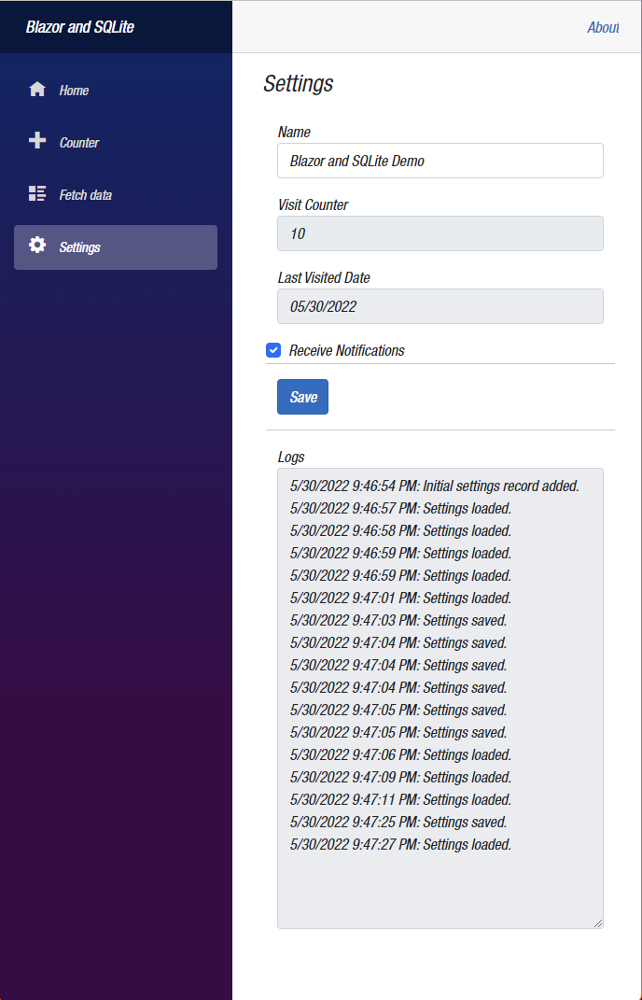  

## Prerequisites

The following prerequisites are needed for this demo.

### .NET 6.0

Download the latest version of the .NET 6.0 SDK [here](https://dotnet.microsoft.com/en-us/download).

>:blue_book: The demo below does not apply to `ASP.NET Core` versions 3.0, 3.1, and 5.0, so we need to use .NET 6.0 for this demo.

### Visual Studio 2022 Preview

For this demo, we are going to use the latest version of [Visual Studio 2022 Preview](https://visualstudio.microsoft.com/vs/community/).

### Mobile Development with .NET Workload

In order to build Blazor apps, the ASP.NET and web development workload needs to be installed, so if you do not have that installed let's do that now.

Make sure you also select .NET WebAssembly build tools as we are going to need it to build C code into WebAssembly.

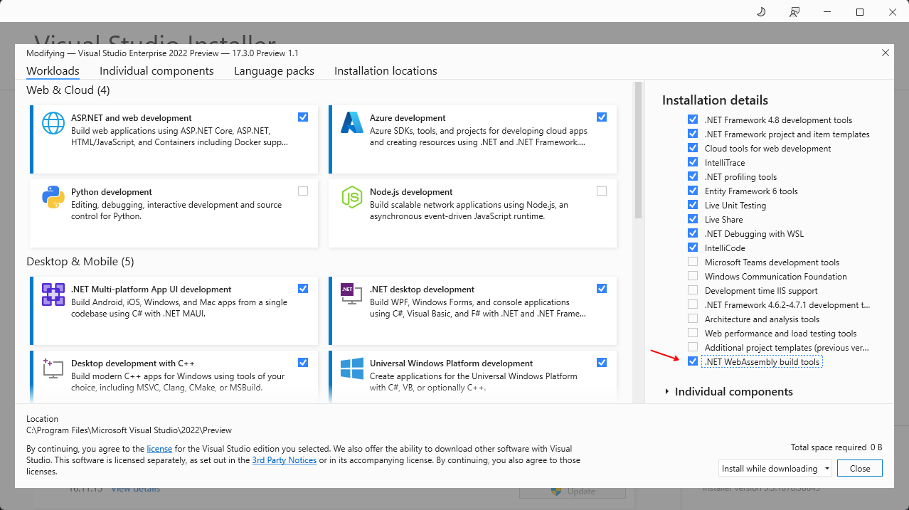  

## Demo

In the following demo we will create a Blazor WebAssembly application and I will show you how to use SQLite to storage application data. In order to do that, we are going to add a dll reference to SQLite and add it to WebAssembly. This was not possible before .NET 6.0.

The "magic" that makes adding specific dlls to WebAssembly possible, is a new feature in .NET 6.0 called Native Dependencies, which gives you the ability to compile such dlls into WebAssembly and statically link them into your application.

According to Microsoft Docs, this is possible by using the same tools used to enable ahead-of-time (AOT) compilation to compile a Blazor app into WebAssembly, as well as relinking the runtime to remove unused features.

To learn more about Native Dependencies take a look at the official Microsoft Docs documentation [ASP.NET Core Blazor WebAssembly native dependencies] (https://docs.microsoft.com/en-us/aspnet/core/blazor/webassembly-native-dependencies?view=aspnetcore-6.0).

### Create a Blazor WebAssembly Application

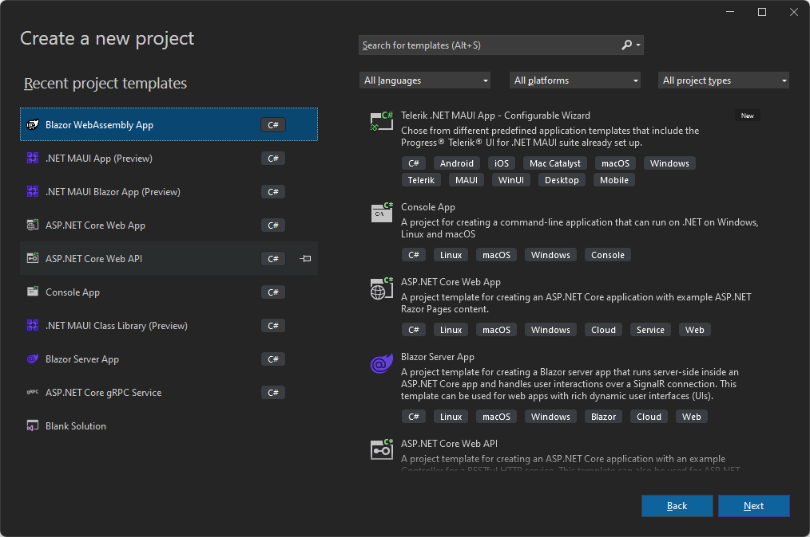  

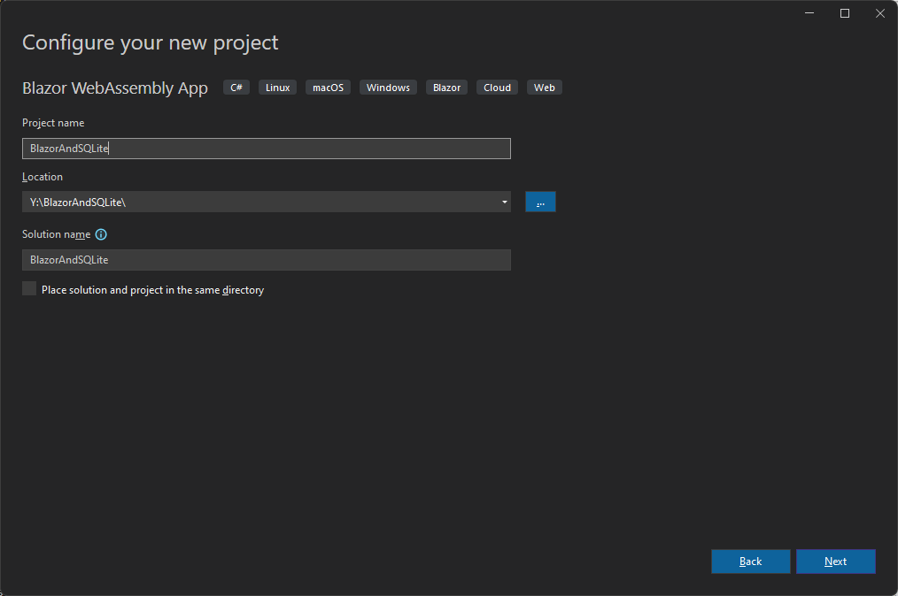  

Make sure you select .NET 6.0 (Long-term support) under Framework.

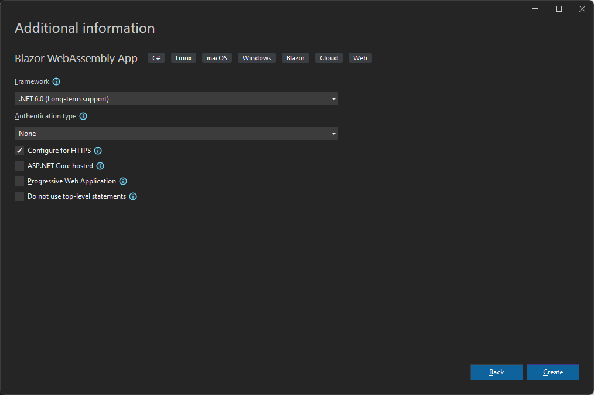  

Let's add a new `Razor Component` and call it `Settings.razor`.

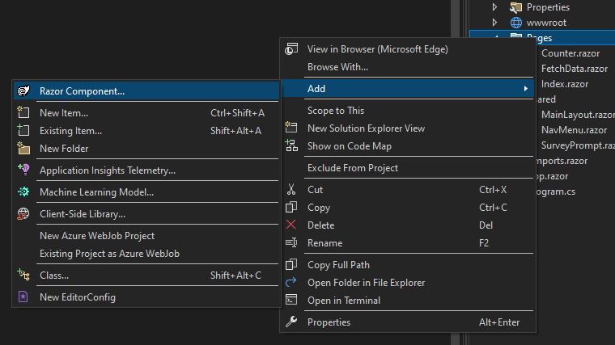  

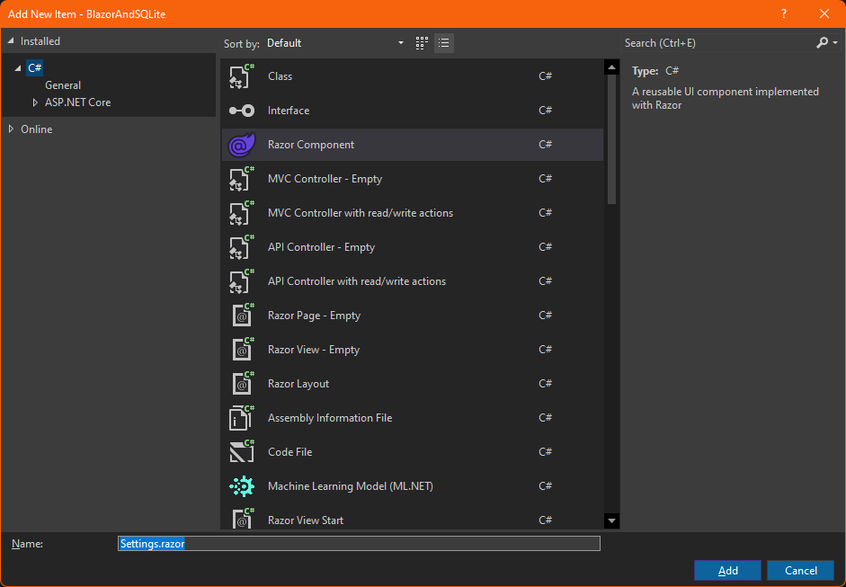  

Add `@page "/settings"` at the top of the new `Settings.razor` file.

```razor
@page "/settings"
```

Open `NavMenu.razor` and add the following code below the `Fetch Data` div, to add the `Settings.razor` page to the main menu.

```razor
        <div class="nav-item px-3">
            <NavLink class="nav-link" href="settings">
                <span class="oi oi-cog" aria-hidden="true"></span> Settings
            </NavLink>
        </div>
```

Build and run the application to make sure things work so far. You should be able to view the `Settings` page.

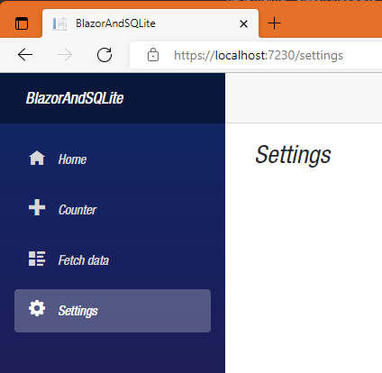  

Let's add a Settings model to hold settings information. Create a `Models` folder and add a `Settings.cs` class. Then add some arbitrary properties of different types, just to test the data storage.

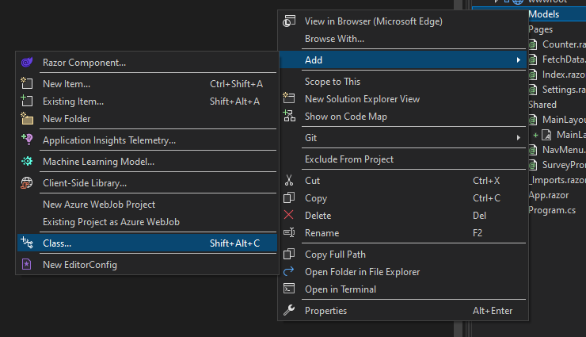  

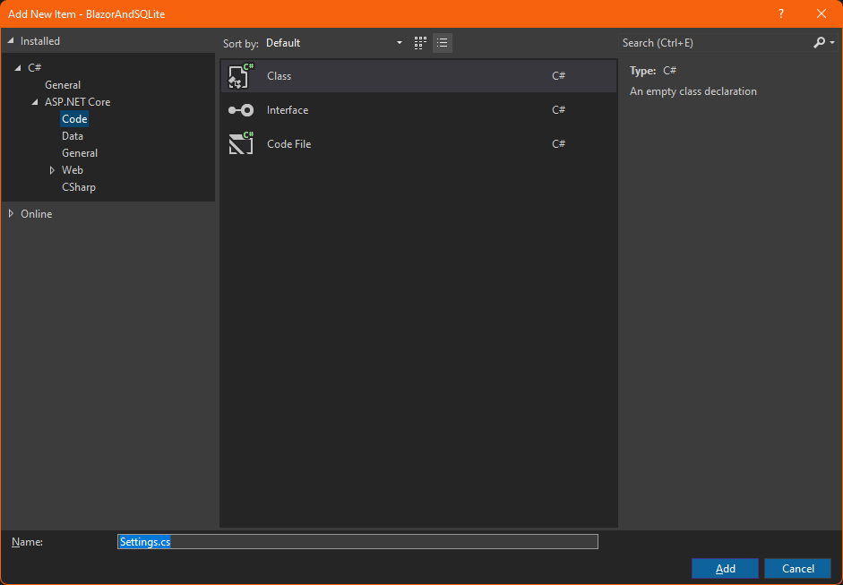

`Settings.cs` file should look like this:

```csharp
using System.ComponentModel.DataAnnotations;

namespace BlazorAndSQLite.Models
{
    public class Settings
    {
        [Key]
        public int Id { get; set; }
        public string Name { get; set; } = string.Empty;
        public int SettingsPageVisitCounter { get; set; } = default;
        public DateTime SettingsPageLastVisitDate { get; set; } = DateTime.UtcNow;
        public bool ReceiveNotifications { get; set; } = default;
        public string Logs { get; set; } = string.Empty;
    }
}
```

Now, we need to add a file to store our connection string to the database, so highlight the `wwwroot` folder and type `Ctrl+Shift+A` to add a new item, type `appsettings` in the search box and accept the default file name `appsettings.json`. 

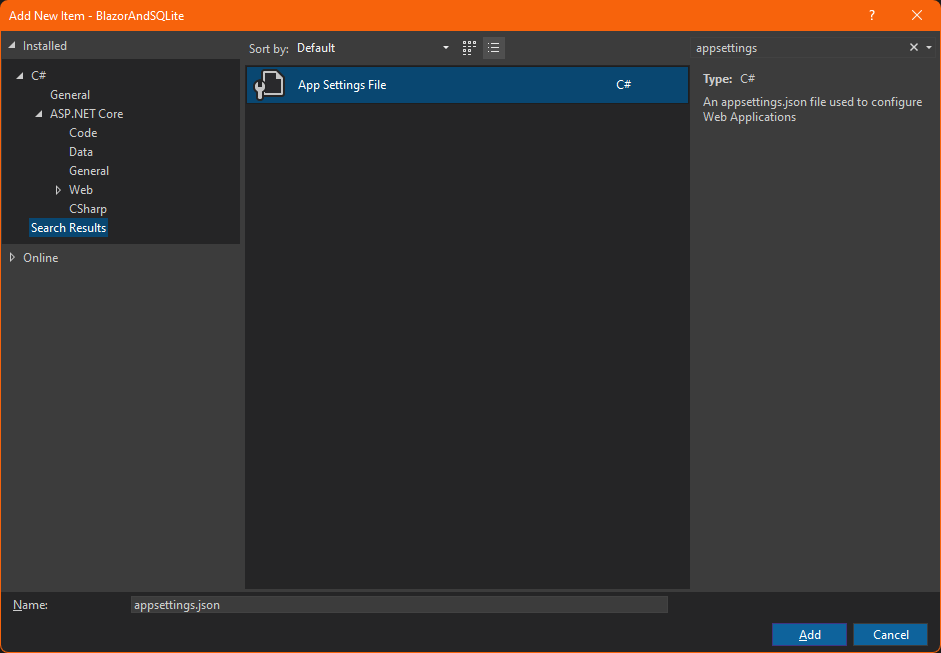  

The default file already comes with a default connection string using `(localdb)\MSSQLLocalDB`.

```json
{
  "ConnectionStrings": {
    "DefaultConnection": "Server=(localdb)\\MSSQLLocalDB;Database=_CHANGE_ME;Trusted_Connection=True;MultipleActiveResultSets=true"
  }
}
```

Since we are going to use `SQLite` in our demo, change the connection string to this:

```json
{
  "ConnectionStrings": {
    "DefaultConnection": "Filename=application.db"
  }
}
```

>:point_up: You can name the database whatever you want, it does not need to be named application.db. For more information about SQLite filenames, check the SQLite official documentation [here](https://www.sqlite.org/draft/shortnames.html#:~:text=The%20default%20configuration%20of%20SQLite%20assumes%20the%20underlying,filename%20extension%20or%20with%20no%20extension%20at%20all.).

Now that we have a connection string available, we need to add an `Application DBContext` to be able to use `EF Core`.

Hit `Shift+Alt+C` to add a new class and call it `ApplicationDbContext.cs`

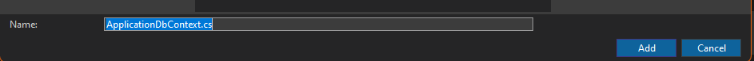  

Replace the default code with this:

```csharp
using BlazorAndSQLite.Models;
using Microsoft.EntityFrameworkCore;

namespace BlazorAndSQLite
{
    public class ApplicationDbContext : DbContext
    {
        public DbSet<Settings> Settings { get; set; } = default!;

        public ApplicationDbContext(DbContextOptions<ApplicationDbContext> options) : base(options)
        { 
        
        }

        protected override void OnModelCreating(ModelBuilder builder)
        {
            base.OnModelCreating(builder);
        }
    }
}

```

### Add SQLite to our Application

In this section, we are going to add SQLite to our Blazor WebAssembly application.

In order to do that, we need to tell our application builder, that we want to use SQLite, so we will need to add a DbContextFactory service by calling `AddDbContextFactory` in the `builder.Services` in our `Program.cs` file, and pass our ApplicationDbContext.

But first, we need NuGet package references to `Microsoft.EntityFrameworkCore`, and `Microsoft.EntityFrameworkCore.Sqlite`. So, let's add those up.

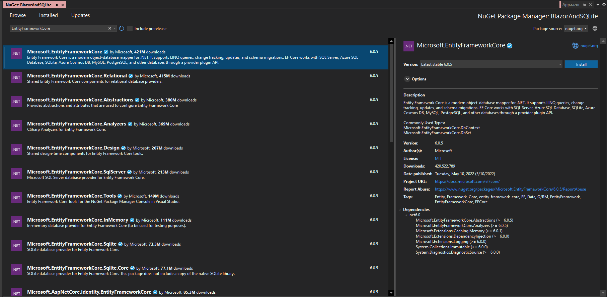  

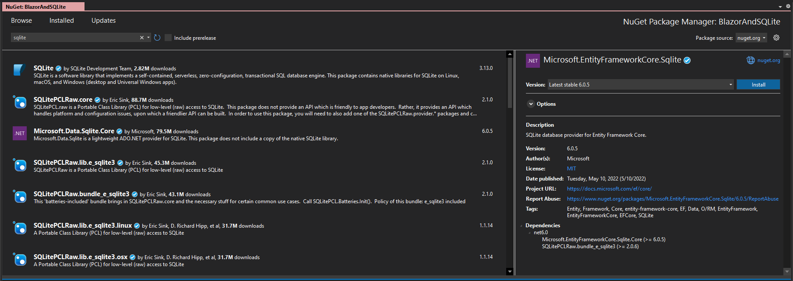  

Now, you can add the using statement `using Microsoft.EntityFrameworkCore;` and configure the service by adding `builder.Services.AddDbContextFactory<ApplicationDbContext>(options => options.UseSqlite(connectionString));`.

To get the connection string out of `appsettings.json` use `var connectionString = builder.Configuration.GetConnectionString("DefaultConnection");`.

Then get an instance of the DbContextFactory service with `var dbContextFactory = builder.Services.BuildServiceProvider().GetService<IDbContextFactory<ApplicationDbContext>>();`.

Use the instance of DbContextFactory to create a DbContext with `var dbContext = dbContextFactory?.CreateDbContext();`.

And finally, use the DbContext to make sure the database exist with `dbContext?.Database.EnsureCreated();`

The complete `Program.cs` file should look like this:

```csharp
using BlazorAndSQLite;
using Microsoft.AspNetCore.Components.Web;
using Microsoft.AspNetCore.Components.WebAssembly.Hosting;
using Microsoft.EntityFrameworkCore;

var builder = WebAssemblyHostBuilder.CreateDefault(args);
builder.RootComponents.Add<App>("#app");
builder.RootComponents.Add<HeadOutlet>("head::after");

builder.Services.AddScoped(sp => new HttpClient { BaseAddress = new Uri(builder.HostEnvironment.BaseAddress) });

// Get connection string from appsettings.json
var connectionString = builder.Configuration.GetConnectionString("DefaultConnection");

// Add a AddDbContextFactory service, and pass the database name to SQLite.
builder.Services.AddDbContextFactory<ApplicationDbContext>(options => options.UseSqlite(connectionString));

// Get an instance of the DbContextFactory service.
var dbContextFactory = builder.Services.BuildServiceProvider().GetService<IDbContextFactory<ApplicationDbContext>>();

// Use the DbContextFactory service to create a DbContext.
var dbContext = dbContextFactory?.CreateDbContext();

// Use the just created DbContext to create the database.
dbContext?.Database.EnsureCreated();

await builder.Build().RunAsync();
```

Add a NuGet package reference to `Microsoft.EntityFrameworkCore.Tools`

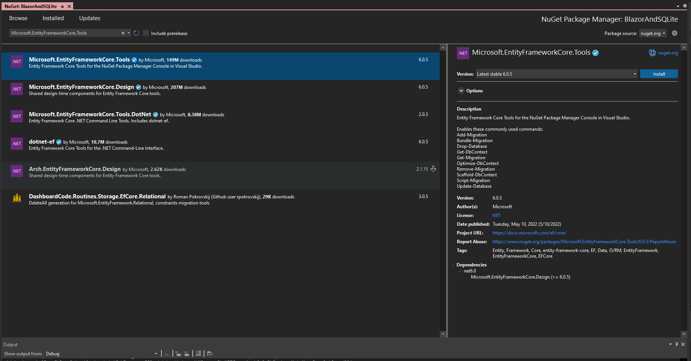  

Adding a reference to `Microsoft.EntityFrameworkCore.Sqlite` is not enough though. If you were to run the application now, you will get the following exception after executing `dbContext?.Database.EnsureCreated();`:

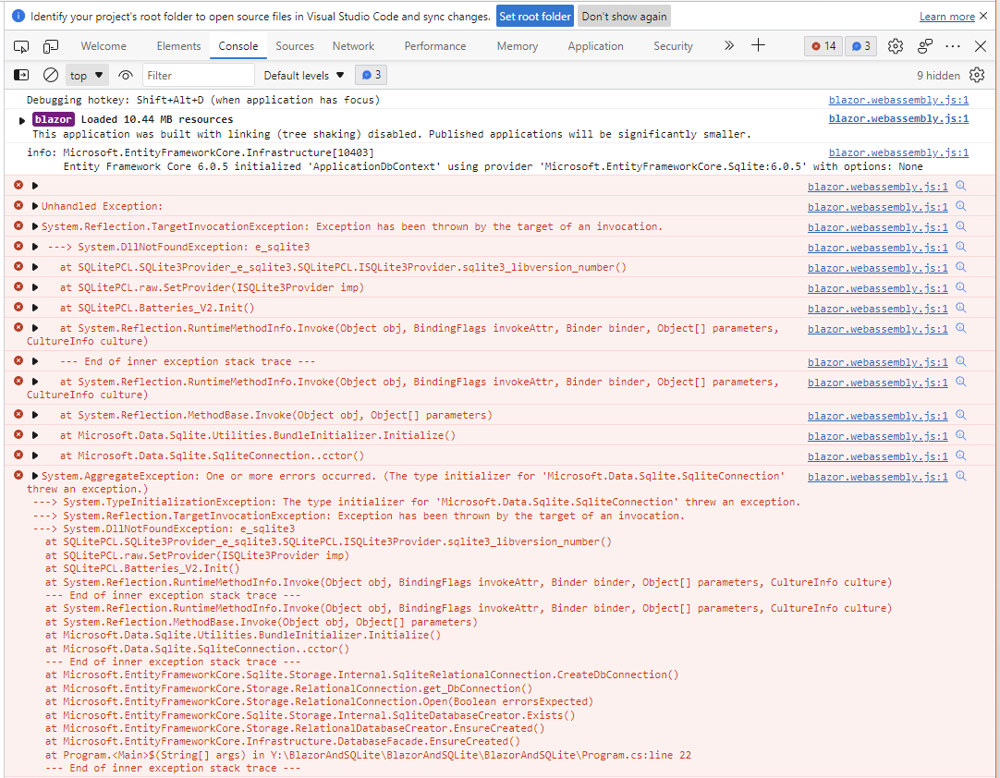  

The exception `System.DllNotFoundException: e_sqlite3` shows that the `e_sqlite3` dll is missing, this is because we haven't included that dll, further more, this is where we need to take advantage of the new feature Native Dependencies in .NET 6.0.

Let's do that now. Go to the [SQLite Downloads] (https://www.sqlite.org/download.html) page, download and unzip sqlite-amalgamation-3380500.zip into your folder of choice.

The zip file contains the SQLite source code in C.

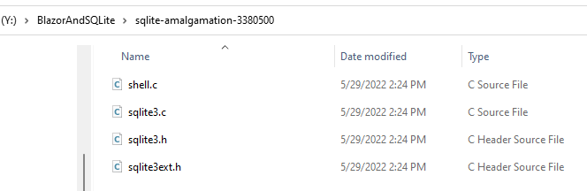  

Now let's download `emscripten` following the instructions in this [link] (https://emscripten.org/docs/getting_started/downloads.html) to compile the SQLite code.

Open the Command Prompt or PowerShell and follow the next steps:

- Clone the `emsdk.git` repo

```powershell
git clone https://github.com/emscripten-core/emsdk.git

Cloning into 'emsdk'...
remote: Enumerating objects: 3307, done.
remote: Counting objects: 100% (26/26), done.
remote: Compressing objects: 100% (17/17), done.
remote: Total 3307 (delta 9), reused 21 (delta 8), pack-reused 3281
Receiving objects: 100% (3307/3307), 1.91 MiB | 4.35 MiB/s, done.
Resolving deltas: 100% (2154/2154), done.
```

- CD into the `emsdk` folder and install the latest `emsdk` SDK

```powershell
cd .\emsdk\
.\emsdk install latest

Resolving SDK alias 'latest' to '3.1.12'
Resolving SDK version '3.1.12' to 'sdk-releases-upstream-a8c3b314d61e2bb98581d522f858132b2fc21488-64bit'
Installing SDK 'sdk-releases-upstream-a8c3b314d61e2bb98581d522f858132b2fc21488-64bit'..
Installing tool 'node-14.18.2-64bit'..
Downloading: Y:/emsdk/zips/node-v14.18.2-win-x64.zip from https://storage.googleapis.com/webassembly/emscripten-releases-builds/deps/node-v14.18.2-win-x64.zip, 30570907 Bytes
Unpacking 'Y:/emsdk/zips/node-v14.18.2-win-x64.zip' to 'Y:/emsdk/node/14.18.2_64bit'
Done installing tool 'node-14.18.2-64bit'.
Installing tool 'python-3.9.2-nuget-64bit'..
Downloading: Y:/emsdk/zips/python-3.9.2-4-amd64+pywin32.zip from https://storage.googleapis.com/webassembly/emscripten-releases-builds/deps/python-3.9.2-4-amd64+pywin32.zip, 14413267 Bytes
Unpacking 'Y:/emsdk/zips/python-3.9.2-4-amd64+pywin32.zip' to 'Y:/emsdk/python/3.9.2-nuget_64bit'
Done installing tool 'python-3.9.2-nuget-64bit'.
Installing tool 'java-8.152-64bit'..
Downloading: Y:/emsdk/zips/portable_jre_8_update_152_64bit.zip from https://storage.googleapis.com/webassembly/emscripten-releases-builds/deps/portable_jre_8_update_152_64bit.zip, 69241499 Bytes
Unpacking 'Y:/emsdk/zips/portable_jre_8_update_152_64bit.zip' to 'Y:/emsdk/java/8.152_64bit'
Done installing tool 'java-8.152-64bit'.
Installing tool 'releases-upstream-a8c3b314d61e2bb98581d522f858132b2fc21488-64bit'..
Downloading: Y:/emsdk/zips/a8c3b314d61e2bb98581d522f858132b2fc21488-wasm-binaries.zip from https://storage.googleapis.com/webassembly/emscripten-releases-builds/win/a8c3b314d61e2bb98581d522f858132b2fc21488/wasm-binaries.zip, 427155258 Bytes
Unpacking 'Y:/emsdk/zips/a8c3b314d61e2bb98581d522f858132b2fc21488-wasm-binaries.zip' to 'Y:/emsdk/upstream'
Done installing tool 'releases-upstream-a8c3b314d61e2bb98581d522f858132b2fc21488-64bit'.
Done installing SDK 'sdk-releases-upstream-a8c3b314d61e2bb98581d522f858132b2fc21488-64bit'.
```

```powershell
.\emsdk activate latest

Resolving SDK alias 'latest' to '3.1.12'
Resolving SDK version '3.1.12' to 'sdk-releases-upstream-a8c3b314d61e2bb98581d522f858132b2fc21488-64bit'
Setting the following tools as active:
   node-14.18.2-64bit
   python-3.9.2-nuget-64bit
   java-8.152-64bit
   releases-upstream-a8c3b314d61e2bb98581d522f858132b2fc21488-64bit

Adding directories to PATH:
PATH += Y:\emsdk
PATH += Y:\emsdk\node\14.18.2_64bit\bin
PATH += Y:\emsdk\upstream\emscripten

Setting environment variables:
PATH = Y:\emsdk;Y:\emsdk\node\14.18.2_64bit\bin;Y:\emsdk\upstream\emscripten;C:\Program Files\PowerShell\7;C:\Program Files\Common Files\Oracle\Java\javapath;C:\Python310\Scripts\;C:\Python310\;C:\Program Files\Eclipse Foundation\jdk-8.0.302.8-hotspot\bin;C:\Program Files\Microsoft\jdk-11.0.12.7-hotspot\bin;C:\Program Files (x86)\Microsoft SDKs\Azure\CLI2\wbin;C:\Program Files\NVIDIA GPU Computing Toolkit\CUDA\v11.4\bin;C:\Program Files\NVIDIA GPU Computing Toolkit\CUDA\v11.4\libnvvp;C:\Program Files (x86)\Common Files\Intel\Shared Libraries\redist\intel64\compiler;C:\Windows\system32;C:\Windows;C:\Windows\System32\Wbem;C:\Windows\System32\WindowsPowerShell\v1.0\;C:\Windows\System32\OpenSSH\;C:\Program Files (x86)\NVIDIA Corporation\PhysX\Common;C:\Program Files\NVIDIA Corporation\NVIDIA NvDLISR;C:\ProgramData\chocolatey\bin;C:\Program Files\Azure Data Studio\bin;C:\Program Files (x86)\Microsoft SQL Server\150\DTS\Binn\;C:\Program Files\TortoiseGit\bin;C:\Program Files\Microsoft VS Code\bin;C:\Program Files\Microsoft VS Code Insiders\bin;C:\Program Files\Microsoft SQL Server\Client SDK\ODBC\170\Tools\Binn\;C:\Program Files\Microsoft SQL Server\130\Tools\Binn\;C:\Program Files\Git\cmd;C:\Program Files\Git\mingw64\bin;C:\Program Files\Git\usr\bin;C:\Program Files\dotnet\;C:\Program Files (x86)\GitExtensions\;C:\Program Files\Git LFS;C:\Program Files\NVIDIA Corporation\Nsight Compute 2021.2.2\;C:\Program Files\Go\bin;C:\Program Files\Microsoft SQL Server\150\DTS\Binn\;C:\Program Files (x86)\Microsoft SQL Server\150\Tools\Binn\;C:\Program Files\Microsoft SQL Server\150\Tools\Binn\;C:\MinGW\bin;C:\WINDOWS\system32;C:\WINDOWS;C:\WINDOWS\System32\Wbem;C:\WINDOWS\System32\WindowsPowerShell\v1.0\;C:\WINDOWS\System32\OpenSSH\;C:\Program Files\nodejs\;C:\Program Files\Docker\Docker\resources\bin;C:\ProgramData\DockerDesktop\version-bin;C:\Program Files (x86)\dotnet-core-uninstall\;C:\Users\admin\AppData\Local\Android\Sdk\platform-tools;C:\Program Files\PowerShell\7\;C:\Users\admin\AppData\Local\Microsoft\WindowsApps;C:\Users\admin\AppData\Local\Programs\Fiddler;C:\Users\admin\.dotnet\tools;C:\Users\admin\go\bin;C:\Program Files\CMake\bin;C:\Users\admin\AppData\Roaming\npm;C:\Users\admin\AppData\Local\Programs\oh-my-posh\bin;C:\flutter\bin
EMSDK = Y:/emsdk
EM_CONFIG = Y:\emsdk\.emscripten
EMSDK_NODE = Y:\emsdk\node\14.18.2_64bit\bin\node.exe
EMSDK_PYTHON = Y:\emsdk\python\3.9.2-nuget_64bit\python.exe
JAVA_HOME = Y:\emsdk\java\8.152_64bit
The changes made to environment variables only apply to the currently running shell instance. Use the 'emsdk_env.bat' to re-enter this environment later, or if you'd like to register this environment permanently, rerun this command with the option --permanent.
```

As the output says, "The changes made to environment variables only apply to the currently running shell instance", so we can run `emsdk_env.bat` "to re-enter this environment later, or if you'd like to register this environment permanently, rerun this command with the option --permanent."

- Run `emsdk_env.bat`

```powershell
.\emsdk_env.bat
Setting environment variables:
PATH = Y:\emsdk;Y:\emsdk\upstream\emscripten;Y:\emsdk\node\14.18.2_64bit\bin;C:\Program Files\PowerShell\7;C:\Program Files\Common Files\Oracle\Java\javapath;C:\Python310\Scripts\;C:\Python310\;C:\Program Files\Eclipse Foundation\jdk-8.0.302.8-hotspot\bin;C:\Program Files\Microsoft\jdk-11.0.12.7-hotspot\bin;C:\Program Files (x86)\Microsoft SDKs\Azure\CLI2\wbin;C:\Program Files\NVIDIA GPU Computing Toolkit\CUDA\v11.4\bin;C:\Program Files\NVIDIA GPU Computing Toolkit\CUDA\v11.4\libnvvp;C:\Program Files (x86)\Common Files\Intel\Shared Libraries\redist\intel64\compiler;C:\Windows\system32;C:\Windows;C:\Windows\System32\Wbem;C:\Windows\System32\WindowsPowerShell\v1.0\;C:\Windows\System32\OpenSSH\;C:\Program Files (x86)\NVIDIA Corporation\PhysX\Common;C:\Program Files\NVIDIA Corporation\NVIDIA NvDLISR;C:\ProgramData\chocolatey\bin;C:\Program Files\Azure Data Studio\bin;C:\Program Files (x86)\Microsoft SQL Server\150\DTS\Binn\;C:\Program Files\TortoiseGit\bin;C:\Program Files\Microsoft VS Code\bin;C:\Program Files\Microsoft VS Code Insiders\bin;C:\Program Files\Microsoft SQL Server\Client SDK\ODBC\170\Tools\Binn\;C:\Program Files\Microsoft SQL Server\130\Tools\Binn\;C:\Program Files\Git\cmd;C:\Program Files\Git\mingw64\bin;C:\Program Files\Git\usr\bin;C:\Program Files\dotnet\;C:\Program Files (x86)\GitExtensions\;C:\Program Files\Git LFS;C:\Program Files\NVIDIA Corporation\Nsight Compute 2021.2.2\;C:\Program Files\Go\bin;C:\Program Files\Microsoft SQL Server\150\DTS\Binn\;C:\Program Files (x86)\Microsoft SQL Server\150\Tools\Binn\;C:\Program Files\Microsoft SQL Server\150\Tools\Binn\;C:\MinGW\bin;C:\WINDOWS\system32;C:\WINDOWS;C:\WINDOWS\System32\Wbem;C:\WINDOWS\System32\WindowsPowerShell\v1.0\;C:\WINDOWS\System32\OpenSSH\;C:\Program Files\nodejs\;C:\Program Files\Docker\Docker\resources\bin;C:\ProgramData\DockerDesktop\version-bin;C:\Program Files (x86)\dotnet-core-uninstall\;C:\Users\admin\AppData\Local\Android\Sdk\platform-tools;C:\Program Files\PowerShell\7\;C:\Users\admin\AppData\Local\Microsoft\WindowsApps;C:\Users\admin\AppData\Local\Programs\Fiddler;C:\Users\admin\.dotnet\tools;C:\Users\admin\go\bin;C:\Program Files\CMake\bin;C:\Users\admin\AppData\Roaming\npm;C:\Users\admin\AppData\Local\Programs\oh-my-posh\bin;C:\flutter\bin
Clearing existing environment variable: EMSDK_PY
```

Now, let's verify `emsdk` is installed correctly.

- Run `emsdk --version`

```powershell
emcc --version

emcc (Emscripten gcc/clang-like replacement + linker emulating GNU ld) 3.1.12 (38d1292ba2f5b4a7c8518931f5ae6f97ef0f6827)
Copyright (C) 2014 the Emscripten authors (see AUTHORS.txt)
This is free and open source software under the MIT license.
There is NO warranty; not even for MERCHANTABILITY or FITNESS FOR A PARTICULAR PURPOSE.
```

>:blue_book: Since I am doing this demo on a Windows PC, I showed you the steps based on that case, in order to run the same steps on a Mac or Linux machines, refer to the instructions in this [link] (https://emscripten.org/docs/getting_started/downloads.html).

- Build SQLite

Now we are ready to build SQLite. CD into the unzipped `sqlite-amalgamation-3380500` folder. In my case is under `Y:\BlazorAndSQLite\sqlite-amalgamation-3380500`, and run `emcc .\sqlite3.c -shared -o e_sqlite3.o` to compile the code.

```powershell
emcc .\sqlite3.c -shared -o e_sqlite3.o

emcc: warning: linking a library with `-shared` will emit a static object file.  This is a form of emulation to support existing build systems.  If you want to build a runtime shared library use the SIDE_MODULE setting. [-Wemcc]
```

Run `dir` and you should see the compiled `e_sqlite3.o` output.

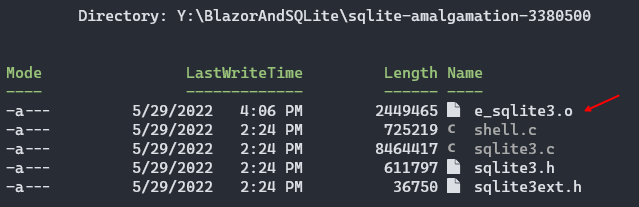  

- Link SQLite into WebAssembly

Now let's copy that file into the root of our project (is not a requirement to be in the root, you can put it in a custom folder, this is specially useful if you are adding multiple dlls.)

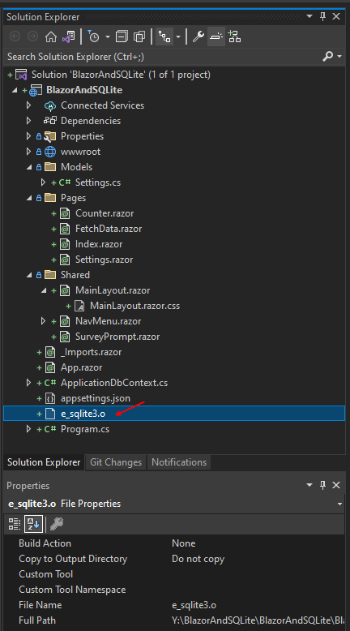  

Edit the `.csproj` project file and add a Native File Reference by adding `<NativeFileReference Include="e_sqlite3.o" />`

>:bulb: TIP: You can double-click any .NET Core project, to quickly open the project file for editing.

The project file should look like this now:

```xml
<Project Sdk="Microsoft.NET.Sdk.BlazorWebAssembly">

  <PropertyGroup>
    <TargetFramework>net6.0</TargetFramework>
    <Nullable>enable</Nullable>
    <ImplicitUsings>enable</ImplicitUsings>
  </PropertyGroup>

  <ItemGroup>
    <PackageReference Include="Microsoft.AspNetCore.Components.WebAssembly" Version="6.0.5" />
    <PackageReference Include="Microsoft.AspNetCore.Components.WebAssembly.DevServer" Version="6.0.5" PrivateAssets="all" />
    <PackageReference Include="Microsoft.EntityFrameworkCore" Version="6.0.5" />
    <PackageReference Include="Microsoft.EntityFrameworkCore.Sqlite" Version="6.0.5" />

	<!-- Add a Native File Reference to the e_sqlite3.o file. -->
	<NativeFileReference Include="e_sqlite3.o" />
  </ItemGroup>

</Project>
```

- Build the Solution

Now, we are ready to build the application, and have the .NET WebAssembly build tools link the `e_sqlite3.o` compiled file to WebAssembly.

Build the solution, and a quick inspect to the build Output screen, will reveal the process:

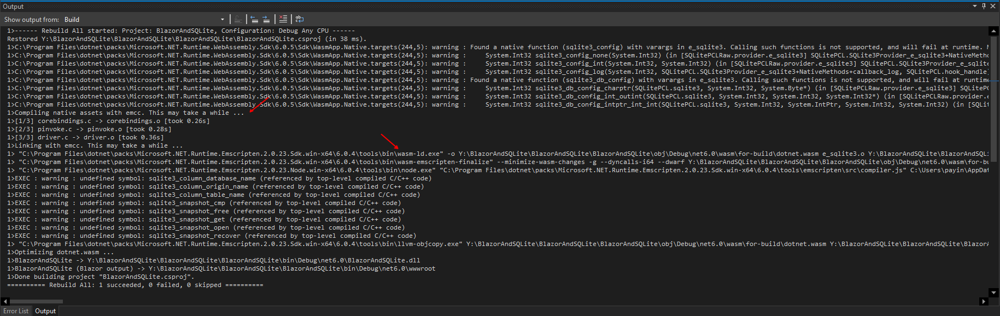  

>:blue_book: Notice that the build will take a little extra time, since the link process was added to the build process.

- Run the Solution

Run the solution, and open the Browser's Developer Tools. You will see after `dbContext?.Database.EnsureCreated();` executes in `Program.cs` file, that our database has been created successfully:

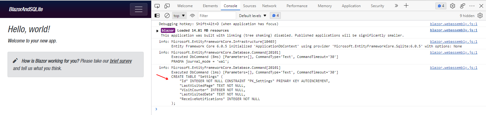  

Now, it is time to add some UI components to update the setting page and get and store values in the database.

Open up `SettingsPage.razor` and replace the code with this:

```razor
@page "/settings"
<h3>Settings</h3>

<EditForm Model="@SettingsViewModel" class="row p-3" OnSubmit="@SaveSettings">
    <div class="col-md-12 mb-3">
        <label for="Name">Name</label>
        <InputText id="Name" @bind-Value="SettingsViewModel.Name" class="form-control" />
    </div>

    <div class="col-md-12 mb-3">
        <label for="Name">Visit Counter</label>
        <InputNumber id="Settings Page Visit Counter" disabled @bind-Value="SettingsViewModel.SettingsPageVisitCounter" class="form-control" />
    </div>

    <div class="col-md-6 mb-3">
        <label for="LastVisitedDate">Last Visited Date</label>
        <InputDate id="Settings Page Last Visit Date" disabled @bind-Value="SettingsViewModel.SettingsPageLastVisitDate" class="form-control" />
    </div>

    <div class="form-check">
        <InputCheckbox id="ReceiveNotifications" @bind-Value="SettingsViewModel.ReceiveNotifications" class="form-check-input" />
        <label class="form-check-label" for="ReceiveNotifications">
            Receive Notifications
        </label>
    </div>

    <hr />

    <div class="col-12 mb-3">
        <button type="submit" class="btn btn-primary">Save</button>
    </div>

    <hr />

    <div class="col-md-12 mb-3">
        <label for="Logs">Logs</label>
        <InputTextArea id="Logs" disabled rows="20" cols="40" @bind-Value="SettingsViewModel.Logs" class="form-control" style="white-space:pre-line;" />
    </div>
</EditForm>
```

Add a new class and call it `SettingsPage.razor.cs` and add the following code:

```csharp
using BlazorAndSQLite.Models;
using Microsoft.AspNetCore.Components;
using Microsoft.EntityFrameworkCore;

namespace BlazorAndSQLite.Pages
{
    public partial class SettingsPage : IDisposable
    {
        [Inject]
        IDbContextFactory<ApplicationDbContext>? DbFactory { get; set; }

        public ApplicationDbContext? DbContext { get; private set; }
        public Settings? SettingsViewModel { get; private set; }

        protected override async Task OnInitializedAsync()
        {
            DbContext = DbFactory?.CreateDbContext();

            if (DbContext?.Settings != null)
            {
                // Get settings record from hypothetical user 1. This is a hard-coded value for demo purposes only.
                var settings = await DbContext.Settings.SingleOrDefaultAsync(c => c.Id == 1);

                // If the settings record for user 1, doesn't exist, create it.
                if (settings == null)
                {
                    settings = new Settings { Id = 1, SettingsPageVisitCounter = 1, Logs = $"{DateTime.UtcNow}: Initial settings record added." };
                    DbContext.Settings.Add(settings);
                }
                else
                {
                    // If the settings record for user 1 exists, increment the page visit counter and add to the logs.
                    settings.SettingsPageVisitCounter += 1;
                    settings.Logs += $"\r\n{DateTime.UtcNow}: Settings loaded.";
                }

                // Save changes in the database.
                await DbContext.SaveChangesAsync();

                // Update the settings view model.
                SettingsViewModel = settings;
            }

            await base.OnInitializedAsync();
        }

        // Save settings data into the database.
        private void SaveSettings()
        {
            if (SettingsViewModel != null)
            {
                SettingsViewModel.Logs += $"\r\n{DateTime.UtcNow}: Settings saved.";
            }

            DbContext?.SaveChangesAsync();
        }

        public void Dispose() => DbContext?.Dispose();
    }
}
```

Now run the application, and you should be able to see the data being created, loaded and saved, as you change pages, the data, and hit the Save button.

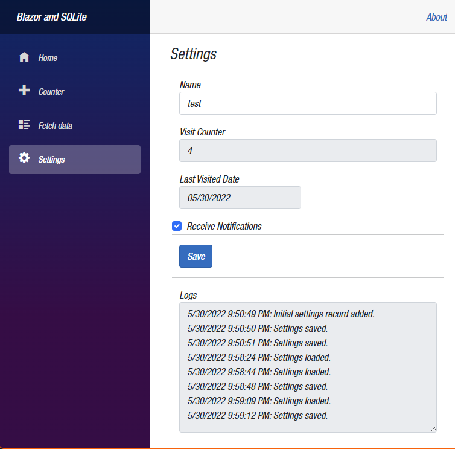  

## Conclusion

The addition of Native Dependencies in .NET 6.0 open-up great opportunities for Blazor WebAssembly applications. As we saw in this demo, as an example, we were able to add third-party source code in C, compile it, and link it to WebAssembly.

In the demo, we added support for SQLite in Blazor WebAssembly applications.

For more information about Blazor and SQLite, check the links in the resources section below.

## Complete Code

The complete code for this demo can be found in the link below.

- <https://github.com/payini/BlazorAndSQLite>

## Resources

| Resource Title                   | Url                                                                                                                                                                                         |
| -------------------------------- | ------------------------------------------------------------------------------------------------------------------------------------------------------------------------------------------- |
| The .NET Show with Carl Franklin | <https://www.youtube.com/playlist?list=PL8h4jt35t1wgW_PqzZ9USrHvvnk8JMQy_>                                                                                                                  |
| Download .NET                    | <https://dotnet.microsoft.com/en-us/download>                                                                                                                                               |
| SQLite                           | <https://www.sqlite.org/index.html>                                                                                                                                                         |
| SQLite And 8+3 Filenames         | https://www.sqlite.org/draft/shortnames.html#:~:text=The%20default%20configuration%20of%20SQLite%20assumes%20the%20underlying,filename%20extension%20or%20with%20no%20extension%20at%20all. |
| Entity Framework Core            | <https://docs.microsoft.com/en-us/ef/core/>                                                                                                                                                 |
| Emscripten Documentation         | <https://emscripten.org/docs/index.html>                                                                                                                                                    |
| Emscripten Download              | <https://emscripten.org/docs/getting_started/downloads.html>                                                                                                                                |
